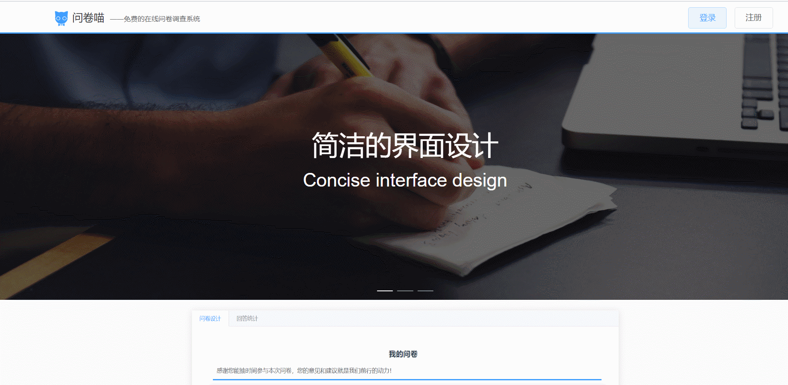
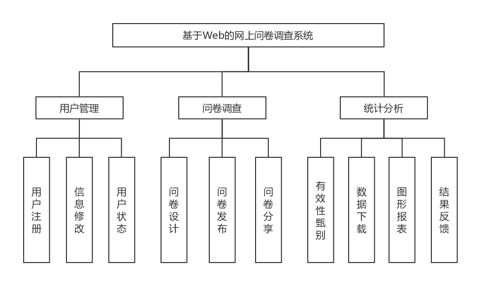
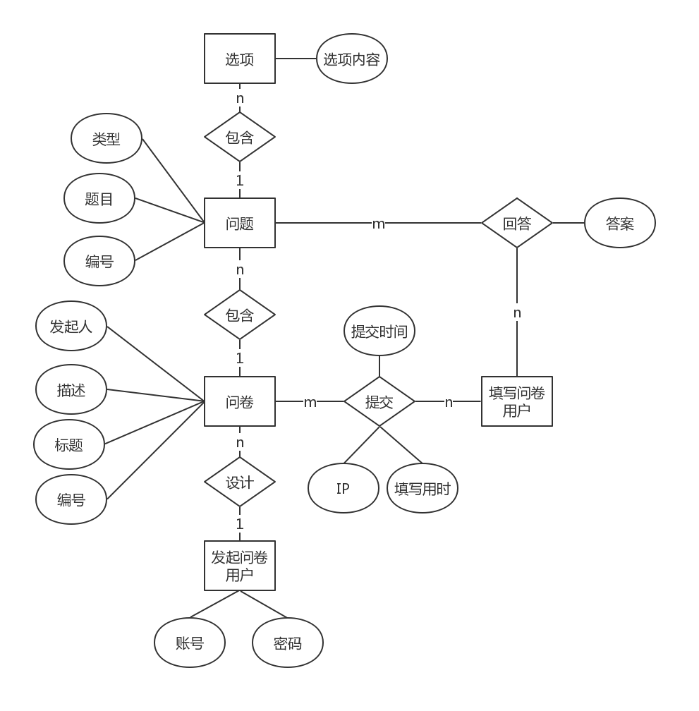
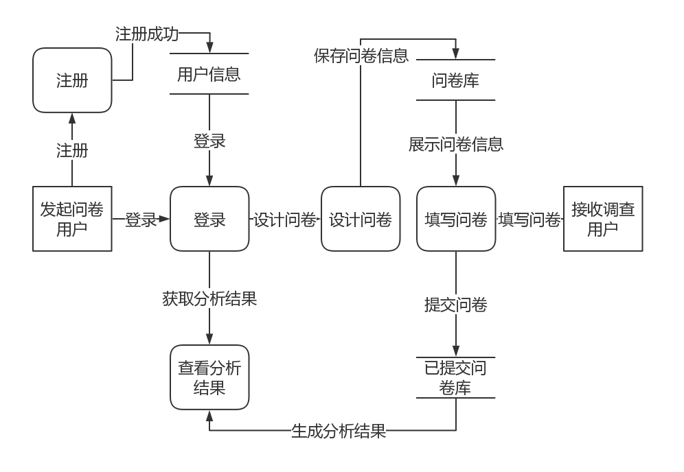

# 问卷调查网站

> 使用 vue 和 django 开发的问卷调查网站。
> [在线演示](https://wjcat.com)（账号密码：shanghaobo）

## 示例



## 功能

- 问卷设计
  - 问卷设计
  - 创建问卷
  - 编辑问卷
  - 发布问卷
  - 删除问卷
  - 分享问卷
- 结果分析
  - 回答统计
  - 数据可视化
- 后台管理
  - 封禁用户
  - 删除问卷

## 结构设计

- 层次方框图



- ER 图



- DFD 图



## 环境

- Node.js：v10.15.1
- Vue.js：2.0
- Python：3.7.0
- Django：2.1.2

## 运行说明

1. 在 wjcatAdmin 里的 seetting.py 配置数据库信息并迁移。具体步骤如下：

   1. 数据库配置位于 `wjcat-release\wjcatAdmin\wjcatAdmin\settings.py` 文件中(将 setting.example.py 改为 setting.py)，具体代码如下（数据库的编码方式为 UTF-8）：

      ```py
      DATABASES = {
          'default': {
              'ENGINE': 'django.db.backends.mysql',
              'NAME': 'dbname',
              'USER': 'username',
              'PASSWORD': 'password',
              'HOST': '127.0.0.1',
              'PORT': '3306',
          }
      }
      ```

   2. 在 `wjcat-release\wjcatAdmin` 目录下依次执行 `python manage.py makemigrations` 和 `python manage.py migrate` 命令对数据库进行迁移。若迁移不成功，可以在 `wjcat-release\wjcatAdmin\myAdmin` 目录下面新建一个 `migrations` 目录，而后 `migrations` 目录内新建一个名为 `__init__.py` 的空文件。

2. 进入 wjcat 目录下，在当前目录打开 cmd 控制台，先使用 npm install 安装依赖，输入 npm run dev 启动前端项目。
3. 进入 wjcatAdmin 目录下，在当前目录打开 cmd 控制台，输入 python manage.py runserver 启动后端项目。
4. 打开浏览器，输入 http://127.0.0.1:8080 即可访问本系统。
5. 也可直接在浏览器输入 http://www.wjcat.com 访问部署后的本系统。

有其他问题可以加入问卷喵交流群：`850804401`

需要docker部署版或协助部署请加QQ：`1186156343`（有偿）
